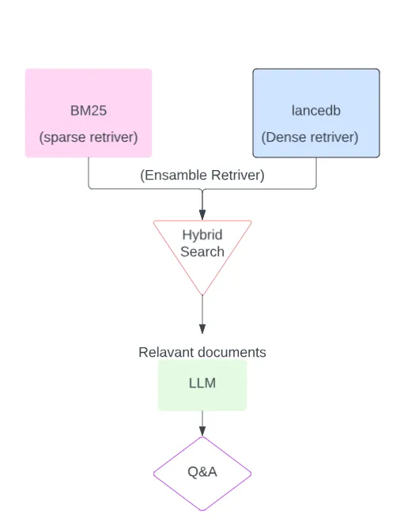

"SmartRAG: Boosted Document QA using Hybrid Multi-query Retrieval &amp; Re-ranking"

# RAG_Implementation

User Query
   ‚Üì
Multi-query generation (e.g., 3 query variants)
   ‚Üì
Hybrid Retrieval (BM25 + Dense Vector Search for each query)
   ‚Üì
Reciprocal Rank Fusion (combine results from all queries & retrievers)
   ‚Üì
Top-K Documents
   ‚Üì
Pass to LLM (with prompt template)
   ‚Üì
Generated Answer

# Case : 1

## Multi-query Retrieval

Instead of using just one query, you generate multiple variations of the user query (via paraphrasing, different phrasings, or prompt rewordings).

This helps capture different intents or nuances that a single query might miss.

These queries are issued in parallel, and results are merged.

Benefit: Improves recall (fetches more relevant results).

Example:

User asks: "How do I fix a flat tire?"
You might also query:

"Steps to repair a bicycle tire",

"Flat tire troubleshooting",

"How to patch a tire tube?"
...then merge the best answers.

# Case : 2

## Hybrid Retrieval

üß™ Hybrid Retrieval
Combines sparse and dense retrieval:

Sparse: Traditional keyword-based search (e.g., BM25)

Dense: Semantic search using vector embeddings (bi-encoders)

Why hybrid? Each method captures different strengths—keywords work well for exact matches, dense works better for semantic similarity.

Example:

"apple" could mean the fruit or the company. Sparse might match documents with the literal word "apple", while dense embeddings capture meaning based on context.

🔁 Re-ranking with Reciprocal Rank Fusion (RRF)
A fusion technique to combine ranked results from different sources (e.g., from BM25 and dense retrieval).

It boosts documents that rank well across multiple rankings, even if not ranked #1 in either.

How it works (briefly):

RRF score = 1 / (k + rank)
Lower ranks (higher positions) get more weight.

Documents that appear in both sparse and dense results get boosted.

🧠 Bi-encoder Models
Used in dense retrieval: Two separate encoders—one for queries, one for documents.

Both are converted into embeddings, and you compute similarity (e.g., dot product).

Faster at inference time than cross-encoders, since you can precompute document embeddings.

Why important:

Forms the basis of many semantic search systems.

Enables retrieval based on meaning, not just matching keywords.

You said:
what is recall in this case? What are the things to evaluate the RAG performance
ChatGPT said:
Great questions! These are crucial concepts when evaluating retrieval systems or Retrieval-Augmented Generation (RAG) models. Let’s go through them clearly and concisely:

üìà What is Recall in Retrieval?
Recall measures how many relevant documents your system retrieved, out of all the relevant documents that exist in the dataset.

üí° Formula:
mathematica
Copy
Edit
Recall = (Number of Relevant Documents Retrieved) / (Total Number of Relevant Documents)
‚úÖ In RAG context:
In a QA system, recall answers:

"Did the retriever retrieve at least one passage that contains the correct answer?"

This is important because even if the generator (e.g., the LLM) is powerful, if the retriever doesn’t find useful documents, the answer might be wrong.

üß™ What Metrics to Use for Evaluating RAG Performance?
You want to evaluate both components:

Retriever

Generator (Answering component)

üîç Retriever Evaluation Metrics:
Recall@k (most important!)

Measures if the correct answer is in the top-k retrieved documents.

Example: Recall@5 = 0.85 ‚Üí 85% of the time, the correct document was in top 5.

Precision@k

Of the top-k retrieved docs, how many are relevant?

Less emphasized in RAG, because recall is more critical.

Mean Reciprocal Rank (MRR)

Gives higher weight to relevant docs retrieved earlier in the ranking.

Useful when you care about ordering.

nDCG (Normalized Discounted Cumulative Gain)

Evaluates how well your system ranks relevant docs.

Especially helpful if you have graded relevance (e.g., "very relevant", "somewhat relevant").

✍️ Generator / End-to-End RAG Evaluation:
Exact Match (EM)

Does the generated answer exactly match the ground-truth answer?

F1 Score

Measures overlap of tokens between the generated answer and ground truth.

Useful for QA tasks where wording might differ.

BLEU / ROUGE / METEOR

Useful for more open-ended generation, like summarization or paraphrasing.

ROUGE is especially popular for evaluating overlaps in longer texts.

Faithfulness / Groundedness

Does the answer stay faithful to the retrieved documents?

Evaluated by:

Human annotation

LLM-as-a-judge (using GPT-4 to grade)

Specialized scoring models like ScorerLLM, RAFT, etc.

Answer Recall

Does the final answer cite/rely on the retrieved documents?

Good for determining whether your RAG system is actually using the retrieved content.

